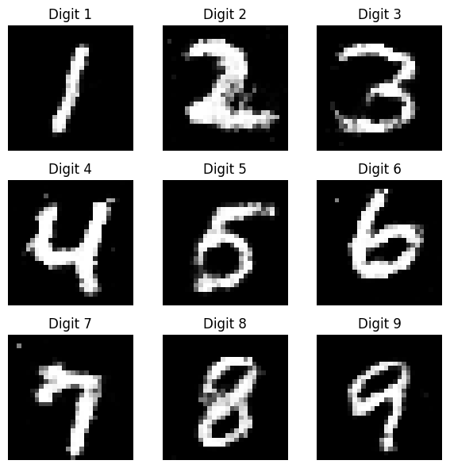

# Simple-GAN-Digit

A simple implementation of GAN and conditional GAN (cGAN) to generate handwritten digit images similar to MNIST.

## Project Structure

```
Simple-GAN-digit/
├─ cGAN_simple.py      # Conditional GAN model
├─ GAN_simple.py       # Vanilla GAN model
├─ main.ipynb          # Notebook: training & visualization examples
├─ requirements.txt    # Dependencies
└─ README.md           # This file
```

## How It Works

* **GAN\_simple.py** implements a basic GAN for MNIST digits.
* **cGAN\_simple.py** implements a Conditional GAN that allows generation of a specific digit (0–9) by conditioning on labels.
* Models are trained on the MNIST dataset (28×28 grayscale).

## Setup

```bash
# clone the repo
git clone https://github.com/nguyenhoangviethung/Simple-GAN-digit.git
cd Simple-GAN-digit

# create venv (optional)
python -m venv venv
source venv/bin/activate   # or venv\\Scripts\\activate on Windows

# install dependencies
pip install -r requirements.txt
```

## Running the Notebook

All key code blocks are located in **main.ipynb**:

### 1️⃣ Train Conditional GAN

```python
from cGAN_simple import CGAN
cgan = CGAN(lr_d=2e-4, lr_g=1e-4)
cgan.train()
```

### 2️⃣ (Optional) Train Vanilla GAN

```python
from GAN_simple import GAN
cgan = CGAN(lr_d=1e-4, lr_g=1e-4)
cgan.train()
```

### 3️⃣ Generate and Visualize 3×3 Digits Grid

```python
import matplotlib.pyplot as plt
from cGAN_simple import CGAN

cgan = CGAN(use_data=False)
fig, axes = plt.subplots(3, 3, figsize=(6, 6))

for idx, digit in enumerate(range(1, 10)):
    imgs = cgan.generate(digit=digit, n_samples=1)
    r, c = divmod(idx, 3)
    axes[r, c].imshow(imgs[0], cmap='gray')
    axes[r, c].set_title(f"Digit {digit}")
    axes[r, c].axis('off')

plt.tight_layout()
plt.show()
```

This code produces a 3×3 grid of generated digits 1–9.

## Results

* After a few epochs the generator produces digits visually similar to MNIST.
* cGAN allows controlling which digit (0–9) to generate.


## Notes

* Training time depends on hardware; using a GPU is recommended.
* The notebook can be run in VS Code, JupyterLab, or Google Colab.

## License

MIT License.
